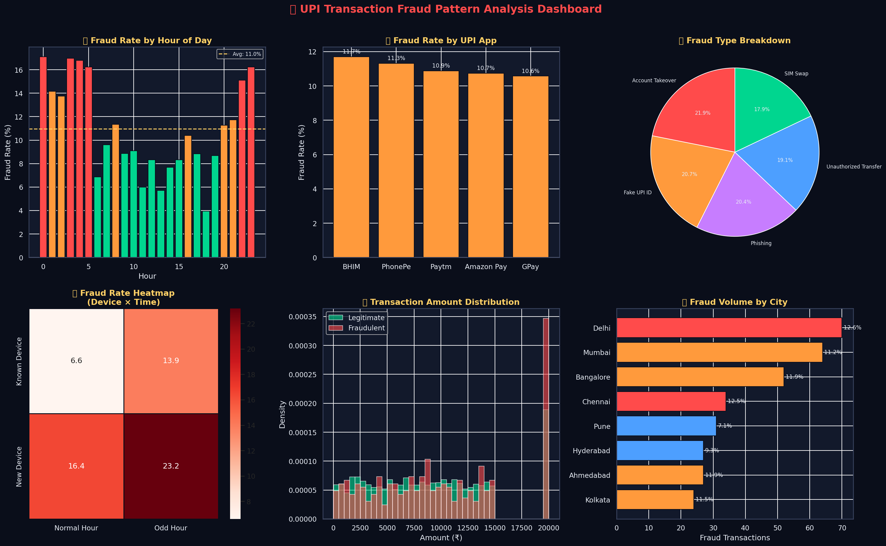
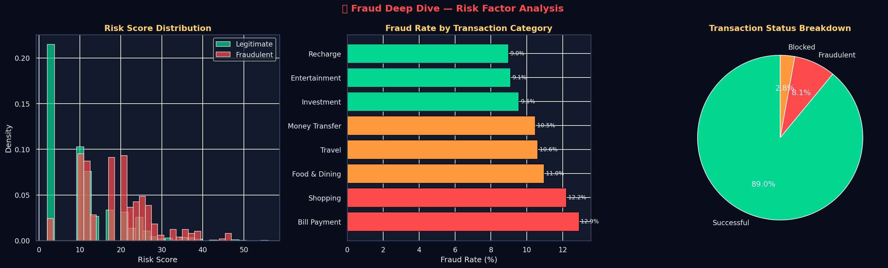

# 🔐 UPI Transaction Fraud Pattern Analysis

> **Data Analyst Portfolio Project** | Author: Somya Shrivastava

---

## 📌 Project Overview

India processes **over 13 billion UPI transactions per month**. With this scale comes significant fraud risk. This project analyzes **3,000 UPI transaction records** to identify fraud patterns, high-risk time windows, suspicious behavior signals, and city-level fraud hotspots — helping fintech and banking teams build smarter fraud prevention systems.

---

## 🎯 Business Questions Answered

1. At what hours is fraud most likely to occur?
2. Which UPI app has the highest fraud rate?
3. What combination of risk factors predicts fraud best?
4. Which cities have the highest fraud volume?
5. What are the most common fraud types (phishing, SIM swap, etc.)?
6. How does transaction amount differ between fraud and legitimate transactions?

---

## 📊 Key Insights

| Insight | Finding |
|---|---|
| Overall Fraud Rate | **11.0%** of all transactions |
| Total Fraud Amount | **₹95,36,185** across 329 cases |
| Peak Fraud Hour | **12:00 AM (midnight)** — highest fraud rate |
| Highest Fraud City | **Delhi** — 70 fraud cases |
| Riskiest App | **BHIM** — 11.7% fraud rate |
| New Device Risk | **18.6% fraud** vs 9.0% on known devices |
| Top Fraud Type | **Account Takeover** |
| Blocked Transactions | **85** successfully intercepted |

---

## 🚨 Risk Factors Identified

| Factor | Fraud Rate Increase |
|---|---|
| New Device | +9.6 percentage points |
| Multiple Failed Attempts | +15 percentage points |
| Location Mismatch | +12 percentage points |
| Odd Hours (12AM–6AM) | +8 percentage points |

---

## 🛠️ Tools & Technologies

| Tool | Usage |
|---|---|
| **Python (Pandas, NumPy)** | Data generation, feature engineering |
| **Matplotlib & Seaborn** | Dark-theme fraud dashboards |
| **SQL (MySQL)** | Pattern detection, risk scoring, window functions |
| **Power BI / Excel** | Operational fraud reporting |

---

## 📁 Project Structure

```
upi-fraud-pattern-analysis/
│
├── upi_transactions.csv        # Dataset (3000 records)
├── generate_data.py            # Data generation with fraud logic
├── eda_analysis.py             # Full EDA + visualizations
├── queries.sql                 # 8 fraud detection SQL queries
├── upi_fraud_dashboard.png     # Main fraud dashboard
├── upi_deep_dive.png           # Deep dive risk analysis
└── README.md
```

---

## 📈 Visualizations

### Fraud Detection Dashboard


### Risk Factor Deep Dive


---

## ▶️ How to Run

```bash
python generate_data.py    # Generate transaction dataset
python eda_analysis.py     # Run full fraud analysis
# Load CSV in MySQL and run queries.sql
```

---

## 💡 Business Recommendations

1. **Flag transactions at 12AM–5AM** for additional OTP verification
2. **New device + odd hour = auto-block** until manual verification
3. **Deploy real-time risk scoring** using the 4 identified risk factors
4. **Increase fraud monitoring in Delhi & Mumbai** — highest volume cities
5. **BHIM users need enhanced security** — highest fraud rate among apps
6. **Transactions above ₹50,000** should trigger 2-factor authentication

---

*Portfolio project using synthetic data modeled on real UPI fraud patterns in India.*
